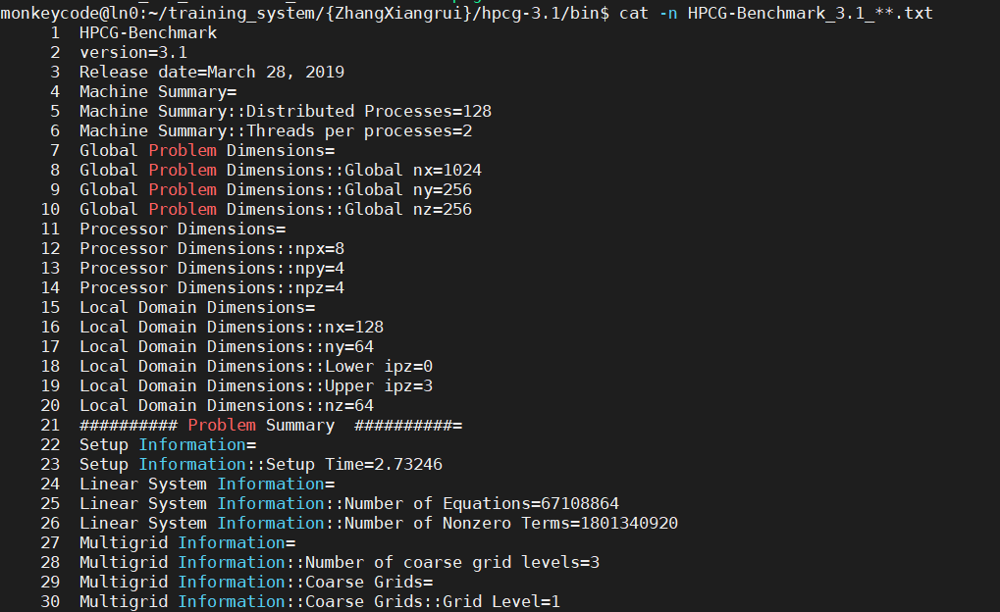
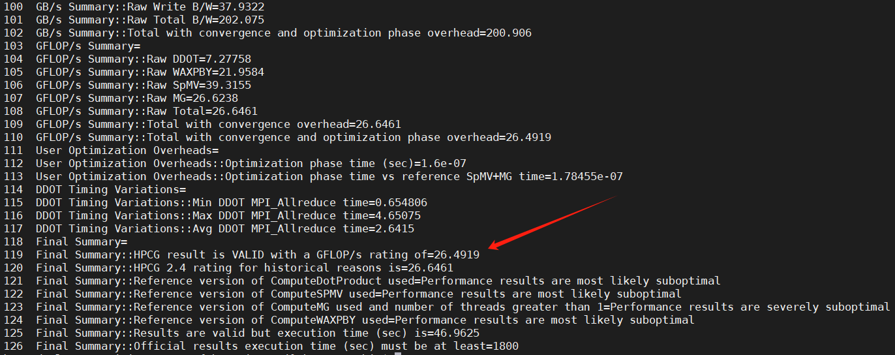

# 任务要求：在超算平台创建你的工作目录，并运行基准测试程序HPCG

为了运行HPCG程序，需要在终端窗口中依次键入如下命令：

1、创建工作目录

cd ~/training_system （进入trainees目录）

mkdir {yourname} （创建学员本人工作目录）

cd {yourname} （进入学员工作目录）

2、运行TOP500基准测试程序HPCG(超级计算机系统的性能评估基准)：

cp –rf ~/software/hpcg-3.1 ./ （将HPCG软件拷贝到当前学员工作目录下）

cd hpcg-3.1/bin （进入HPCG运行目录下）

export OMP_NUM_THREADS=2（运行HPCG的二进制文件xhpcg,使用了4个节点，128个进程，每进程派生2个线程）

yhrun -p thcp1 -N 4 -n 128 -c 2 ./xhpcg（通过yhrun命令运行HPCG的二进制文件xhpcg，指定使用了4个节点，共128个进程，每个进程能支配2个cpu cores）

3、等待运行结束，查看测试结果文件：

cat –n HPCG-Benchmark_3.1_**.txt（第119行数据即为4个节点的总浮点计算速率GFLOP/s）

注：目录说明：

学员目录应创建在~/training_system中。 （符号 ~ 表示用户根目录）

如，张三目录：~/training_system/zhangsan

如果完成任务请填写并提交使用4个节点计算出的HPCG总浮点计算速率，即HPCG-Benchmark3.1**.txt文件中该行显示的数据：

Final Summary::HPCG result is VALID with a GFLOP/s rating of=xxx

# 以下是我在计算平台上的运行过程：
  

经运行，我的结果显示为：
Final Summary::HPCG result is VALID with a GFLOP/s rating of=26.4919
