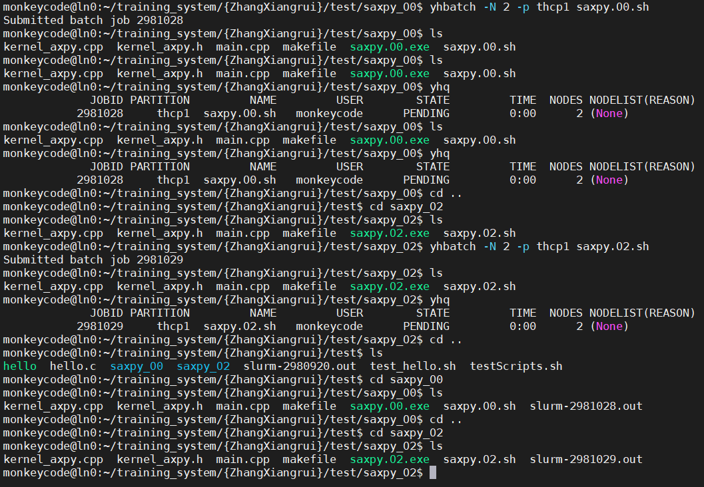

# 程序saxpy实现了单精度浮点型数据的向量加法运算，其具体公式如下：

y[n]=y[n]+a*x[n]

其中，n为向量长度，x、y为向量数组，a为标量系数，x、y、a均为单精度浮点型float。

各变量的初始值如下：

n为102400

a为3.14

x中各元素初始为0.0~6.0间的浮点型随机数

y初始取值为y[n] = 12.0 - a * x[n]

## 程序的文件组织如下：

kernel_axpy.h

负责向量加法接口函数的声明如下：
1. void saxpy(const float a,const float * const x, float *y)。
2. 其中，a、x 为输入, y 即为输入、也为输出。

kernel_axpy.cpp 

负责向量加法接口函数saxpy()的定义实现。

main.cpp 

负责初始化向量。调用向量加法接口saxpy()  
使用计时函数clock()统计saxpy()的运行时间，并打印到屏幕  
打印结果y的前20个元素数值到文件y_value.txt  

# 编写Makefile，用以编译课程的作业saxpy程序
要求：

分别使用-O0、-O2优化等级的编译选项
将编译和链接阶段分开
二进制文件名称分别命令为saxpy.O0.exe，saxpy.O2.exe

# 我已经将使用-O0、-O2优化等级的编译选项分别写成两个Makefile文件，里面所使用的 kernel_axpy.h， kernel_axpy.cpp，main.cpp 内容上是一样的，仅仅根据不同编译要求达到不同的优化等级实现。

***下面是我的操作过程和运行结果：***

# 通过slurm系统，提交运行编译好的saxpy.exe作业

要求：
- 编写shell脚本yhrun.sh，通过yhrun命令，把程序一并提交到天河超算中进行并行计算
- 使用yhbatch命令，提交yhrun.sh脚本，使程序在后台运行。
- 核心结果文件ty_value.txt内容，应详细记录的性能。各项均应小于12.0
- 对比-00和-02两种优化等级下的saxpy.00.exe和saxpy.02.exe运行时间

提示：  
1. shell脚本即为命令的集合，这类文件以.sh后缀结尾，文件内容的形式如下，第一行需指明解释器路径： #!/bin/bash
2. 敲入具体命令 yhrun ………
  
如果完成了该任务，请指导并提交如下信息：
1. 所使用的登录账户
2. 学员完成该任务所创建的目录或文件路径
3. 记录具体任务参数的路径
4. yhrun.sh脚本文件内容
5. saxpy.00.exe和saxpy.02.exe程序的运行时间，对比分析两段运行时间

***下面是我的操作过程和运行结果：***
 
